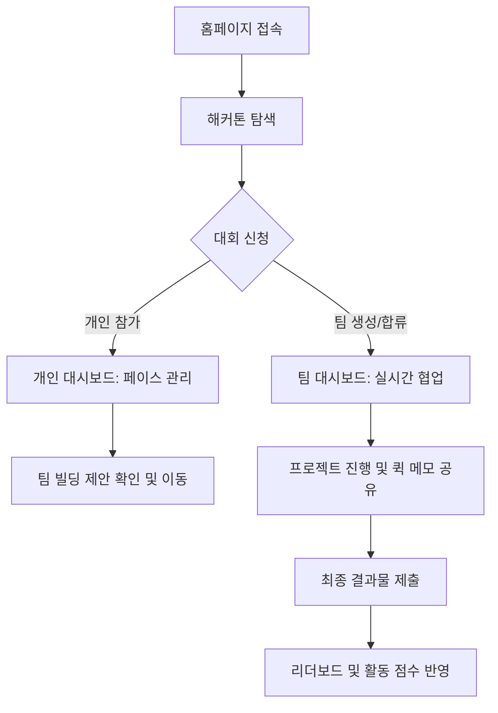

# Daker(Antigravity) 프로젝트 명세서 (Project Blueprint)

본 문서는 AI 기반 해커톤 팀 매칭 플랫폼 **'Daker'**의 전체 아키텍처, 핵심 로직 및 데이터 구조를 상세히 정의한 기술 명세서입니다. 본 플랫폼은 사용자 경험 중심의 비비드(Vivid) 디자인과 고도화된 매칭 지능을 결합하여 최적의 팀 빌딩 환경을 제공합니다.

---

## 1. 서비스 개요 및 아키텍처 (Overview)

### 서비스 컨셉 및 디자인 시스템
*   **Daker (Antigravity)**: 무중력 상태처럼 제약 없는 창의적 협업을 지향하는 플랫폼입니다.
*   **Vivid Design System**: 시각적으로 강렬한 보라색(`Violet-600`)을 메인 컬러로 사용하며, `Framer Motion`을 활용한 부드러운 레이아웃 전이와 `Glassmorphism` 효과를 통해 프리미엄한 UI/UX를 구현했습니다.

### 기술 스택 (Tech Stack)
| 구분 | 기술명 | 용도 |
| :--- | :--- | :--- |
| **Framework** | Next.js 14+ (App Router) | 클라이언트 서버 렌더링 및 라우팅 |
| **Language** | TypeScript | 정적 타이핑을 통한 코드 안정성 확보 |
| **Styling** | Tailwind CSS | 유틸리티 퍼스트 방식의 신속하고 일관된 스타일링 |
| **Animation** | Framer Motion | 인터랙티브한 UI 애니메이션 및 UX 피드백 |
| **Charts** | Recharts | 육각형 역량 리포트(Radar Chart) 시각화 |
| **Icons** | Lucide-React | 표준화된 벡터 아이콘 라이브러리 |

### 데이터 관리 전략
*   **Single Source of Truth (SSOT)**: 외부 데이터베이스(DB) 연결 없이 브라우저의 `LocalStorage`를 중앙 저장소로 사용합니다.
*   **Storage Framework**: [lib/storage.ts](file:///c:/Users/rrlk/Desktop/daker/app-src/lib/storage.ts)에서 모든 데이터의 읽기/쓰기([getStorage](file:///c:/Users/rrlk/Desktop/daker/app-src/lib/storage.ts#180-192), [setStorage](file:///c:/Users/rrlk/Desktop/daker/app-src/lib/storage.ts#193-198)) 및 초기화([initStorage](file:///c:/Users/rrlk/Desktop/daker/app-src/lib/storage.ts#139-179))를 중앙 집중식으로 관리합니다.

---

## 2. 핵심 기능 및 상세 로직 (Feature & Logic)

### 2.1 지능형 매칭 알고리즘 (AI Matching Engine)
사용자의 기술 스택과 팀의 요구 사항을 분석하여 적합도를 계산합니다.
*   **작동 원리**: 사용자 프로필의 `techStack` 카테고리(직군)가 팀의 `lookingFor`와 일치하는지 확인하고, 개별 스택의 키워드 매칭을 통해 가산점을 부여합니다.
*   **배점 방식**: 
    | 항목 | 점수 | 설명 |
    | :--- | :--- | :--- |
    | **직군 일치 (Role Match)** | 50점 | Frontend/Backend 등 대항목 일치 시 부여 |
    | **세부 스택 일치 (Stack Match)** | 개당 20점 | `react`, `typescript` 등 키워드 일치 시 누적 |
*   **정규화**: `toLowerCase()` 처리를 통해 대소문자 구분 없이 매칭됩니다.
*   **핵심 코드**: [app/camp/page.tsx](file:///c:/Users/rrlk/Desktop/daker/app-src/app/camp/page.tsx) 내 `filtered.map` 로직

### 2.2 참가 상태 머신 (Participation Status Machine)
사용자의 참가 유형(개인 vs 팀)에 따른 상태 전이와 권한을 관리합니다.
*   **Free Agent (개인 참가)**: 초기 해커톤 신청 시 '개인 참가자' 상태로 시작하며, 대시보드에서 본인의 페이스를 관리할 수 있습니다.
*   **Team Member (팀 참가)**: 팀 생성 또는 다른 팀의 합류 승인/초대 수락 시 상태가 전환됩니다.
*   **권한 승계**: 팀 합류 시 기존의 개인 참가 데이터(Solo Team)는 자동으로 정리되고 팀 관리 권한(`Team Dashboard`)을 획득합니다.
*   **핵심 코드**: [lib/storage.ts](file:///c:/Users/rrlk/Desktop/daker/app-src/lib/storage.ts)의 [manageInvitation](file:///c:/Users/rrlk/Desktop/daker/app-src/lib/storage.ts#434-512), [manageApplicant](file:///c:/Users/rrlk/Desktop/daker/app-src/lib/storage.ts#619-678)

### 2.3 전문화된 대시보드 (Specialized Dashboards)
사용자의 참가 상태에 따라 서로 다른 도구를 제공합니다.
*   **Personal Dashboard**: 단계별 로드맵(Phase Tracker)과 개인 할 일 목록(To-Do)을 통해 '완성'에 집중합니다.
*   **Team Dashboard**: 퀵 메모(Quick Memo), 멤버별 실시간 작업 현황, 지원자 관리 기능을 통해 '협업'에 집중합니다.
*   **라우팅 로직**: [app/profile/page.tsx](file:///c:/Users/rrlk/Desktop/daker/app-src/app/profile/page.tsx)에서 참가 상태를 판별하여 `/personal-dashboard/[slug]` 또는 `/teams/[id]` 중 하나로 자동 라우팅합니다.

### 2.4 통합 랭킹 시스템 (Ranking System)
공정한 데이터 집계를 위해 모든 대회가 아닌 성적 기반의 선별적 합산을 수행합니다.
*   **상위 3개 원칙**: 사용자가 참여한 모든 해커톤 성적 중 **가장 높은 상위 3개 대회**의 점수만 합산하여 유저 활동 점수를 산출합니다.
*   **계산식**: [(Math.sqrt(총 팀 수) / Math.sqrt(순위)) * 100](file:///c:/Users/rrlk/Desktop/daker/app-src/app/teams/%5Bid%5D/page.tsx#53-56) (대회 규모와 등수를 동시에 고려)
*   **핵심 코드**: [lib/storage.ts](file:///c:/Users/rrlk/Desktop/daker/app-src/lib/storage.ts)의 [getGlobalRankings](file:///c:/Users/rrlk/Desktop/daker/app-src/lib/storage.ts#283-324)

### 2.5 실시간 동기화 & 피드백 (Sync & Notifications)
*   **Storage Event**: 프로필 변경이나 팀 상태 변경 시 `window.dispatchEvent(new Event('storage'))`를 호출하여 다른 탭이나 컴포넌트의 UI를 즉시 재정렬합니다.
*   **Toast 시스템**: [ToastProvider](file:///c:/Users/rrlk/Desktop/daker/app-src/components/ToastProvider.tsx#13-49)를 통해 성공/오류/정보 알림을 사용자에게 비비드하게 전달합니다.

---

## 3. 데이터 모델 및 스토리지 구조 (Data Schema)

### 주요 객체 구조
[lib/storage.ts](file:///c:/Users/rrlk/Desktop/daker/app-src/lib/storage.ts)에 정의된 핵심 인터페이스입니다.

*   **User**: `name`, `tag` (고유번호), `bio`, `techStack`
*   **Team**: [id](file:///c:/Users/rrlk/Desktop/daker/app-src/components/ToastProvider.tsx#13-49), `teamName`, `members`, `recruiting`, `lookingFor`, `master`, `quickMemos`, `isFinalized`
*   **Hackathon**: `slug`, `title`, `status` (ongoing/upcoming/ended), `period`
*   **Application/Invitation**: 지원자 정보([Applicant](file:///c:/Users/rrlk/Desktop/daker/app-src/lib/storage.ts#31-40))와 초대 이력을 각각 별도 객체로 관리하여 데이터 추적성을 확보했습니다.

### 데이터 초기화 (Centralized Constants)
모든 초기 데이터는 상수화되어 관리되며, 첫 접속 시 [initStorage()](file:///c:/Users/rrlk/Desktop/daker/app-src/lib/storage.ts#139-179)를 통해 LocalStorage에 주입됩니다.
*   `INITIAL_HACKATHONS`, `INITIAL_USER_PROFILE`, `INITIAL_TEAMS` (from JSON)

---

## 4. 사용자 여정 (User Flow)



---

## 5. 프로젝트 파일 맵 (File Mapping)

```text
src/
├── app/
│   ├── camp/page.tsx           # AI 매칭 및 팀 모집 리스트
│   ├── hackathons/[slug]/      # 상세 정보 및 리더보드 탭
│   ├── personal-dashboard/     # 개인 참가자 전용 로드맵 가이드
│   ├── teams/[id]/             # 실시간 팀 협업 대시보드
│   └── profile/page.tsx        # 유저 역량 분석 및 내비게이션 허브
├── components/
│   ├── Toast/                  # 비비드 알림 컴포넌트
│   └── ConfirmModal/           # 공용 확인 모달
└── lib/
    ├── storage.ts              # Single Source of Truth, 비즈니스 로직
    └── constants.ts            # 기술 스택, 포지션 정의 등 설정값
```

---

## 6. 핵심 코드 스니펫 (Agent's Picks)

### "이 부분은 정말 잘 짰다" - AI 기반 실시간 적합도 계산 로직
[app/camp/page.tsx](file:///c:/Users/rrlk/Desktop/daker/app-src/app/camp/page.tsx)에서 사용자가 프로필을 저장할 때마다 실시간으로 팀 리스트의 추천 순위가 변하는 부분입니다.

```typescript
// 50점(직군) + 20점(세부 스택) 반영 및 실시간 정렬
const totalScore = roleScore + stackScore;
console.log(`[MatchScore Calculation] Team: "${t.teamName}", Score: ${totalScore}`);

// 정렬 우선순위: 내 팀 > 내 지원팀 > AI 추천팀(Score) > 일반팀 > 마감팀
return { ...t, matchScore: totalScore };
```

> [!TIP]
> **왜 잘 짰는가?**: 단순히 점수만 계산하는 것을 넘어, `Storage Event`와 결합하여 유저가 자신의 프로필(관심 기술)을 바꾸는 즉시 매칭 리스트가 애니메이션과 함께 재정렬되도록 설계하여 '지능형 매칭'을 시각적으로 체감하게 했습니다.

---

## 7. 향후 확장성 (Roadmap)

1.  **Backend Integration**: 현재의 LocalStorage 아키텍처를 `Supabase` 또는 `Firebase`로 이관하여 진정한 실시간 통신 및 데이터 영속성 확보.
2.  **Collaborative Editing**: `Team Dashboard`의 공유 관리 기능(Shared Notes)을 넘어서는 실시간 동시 편집 기능(OT/CRDT 기반) 도입.
3.  **Advanced AI**: 단순 키워드 매칭을 넘어 LLM 기반의 제안서 분석 및 팀 조합 자동 추천 시스템 고도화.
